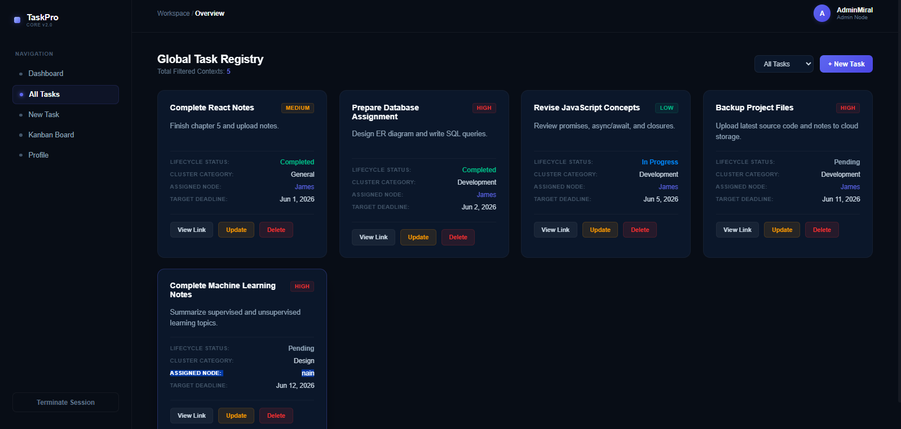
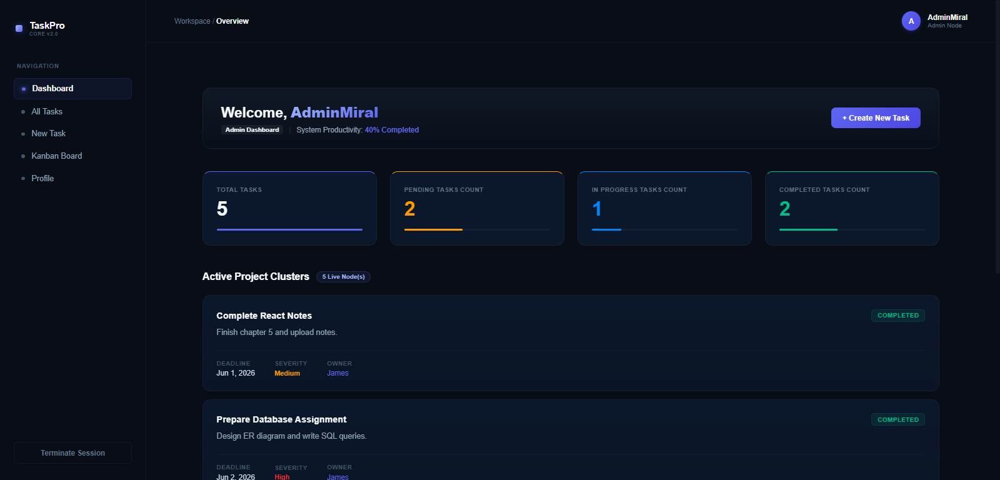
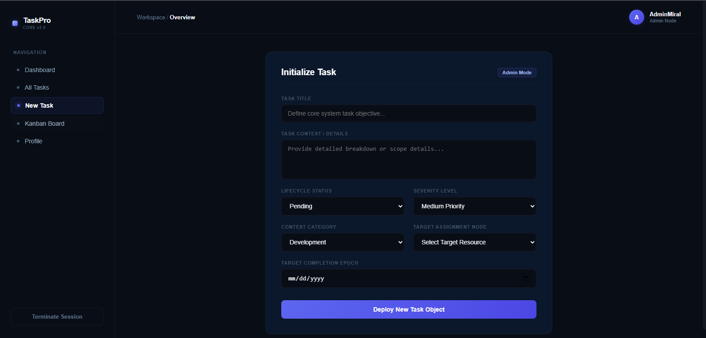
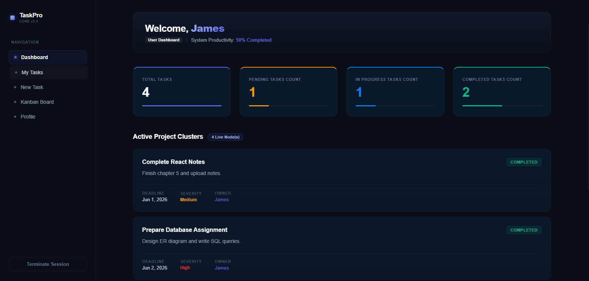
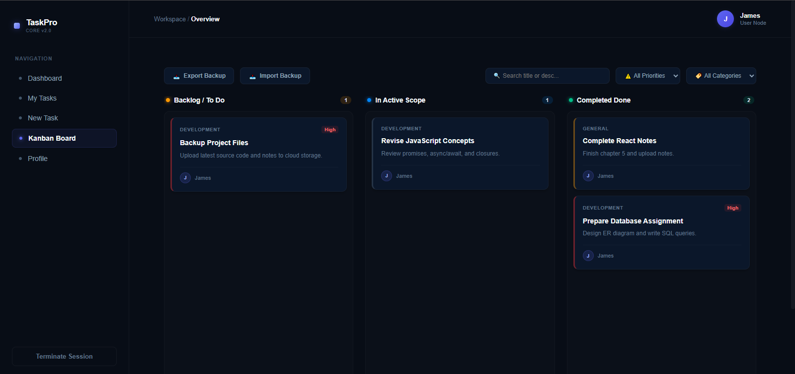

#  .NET Fullstack Task Management Tool

##  2. Prerequisites
* **[.NET SDK 10.0](https://dotnet.microsoft.com/download)**
* **[SQL Server & SSMS](https://learn.microsoft.com/en-us/sql/ssms/download-sql-server-management-studio-ssms)** (Database host karne ke liye)
* **Git** 

3. Step-by-Step Setup & Execution Guide

### Step 1: Clone the Repository
git clone https://github.com/HajiraImran/.NET-Fullstack-10pShine.git
cd .NET-Fullstack-10pShine

### Step 2: Configure SQL Server connection string

"ConnectionStrings": {
  "DefaultConnection": "Server=YOUR_SERVER_NAME;Database=TaskManagementDb;Trusted_Connection=True;TrustServerCertificate=True;"
}

### Step 3: Run Database Migrations
cd Backend

### Install Entity Framework tools if not installed:
dotnet tool install --global dotnet-ef

### to generate table and relationships in Database:
dotnet ef database update

### Step 4: Start the server
dotnet run

### Running Automated Unit Tests

cd Backend.Tests
dotnet test

Reading Test Execution Logs
Backend.Tests/test_execution.log

dotnet restore

### For frontend

cd Frontend
npm install
npm start

### Triggering SonarQube Code Quality Analysis

dotnet tool install --global dotnet-sonarscanner

### 1. Open Scanner Tunnel and map security credentials
dotnet sonarscanner begin /k:"TaskManagementTool" /d:sonar.host.url="http://localhost:9000" /d:sonar.token="YOUR_SONARQUBE_GENERATED_TOKEN"

### 2. Recompile completely to generate tracing binaries
dotnet build --no-incremental

### 3. Terminate analysis sequence and deploy metrics telemetry payload to dashboard
dotnet sonarscanner end /d:sonar.token="YOUR_SONARQUBE_GENERATED_TOKEN"

## Project Dashboards 

# Project Dashboards 

### 1. Admin Dahbord Taks list

### 2. Admin Dashboard

### 3. New Task Screen

### 4. User Dashboard

### 4. Kanban Board
